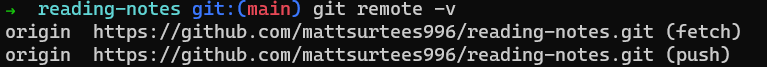

# Class 3 - Revisions & The Cloud

In today's lesson - 
 - We learnt about Git, What it is and How it is used.
 - Learnt about new commands to retrieve, and push work to and from the cloud.
 
## What is Git?
 
 It was given the name 'Git' by Linus Torvalds in 2005. 'Git' is a version-control system for tracking changes in computer files and coordinating work on those files among multiple people.

## New commands -

##### git status
To check a file's status - 

##### git push origin main
This command pushes changes from the local “main” branch to the remote repository named “origin” -  

##### git remote -v
This command will show you all URL's which are connected to the original file which you have fetched & pushed back to the cloud 

##### git commit
This command will save all staged changes, where a new version of the project will be created in the original repo. ! [git-commit.png](../git-commit.png
