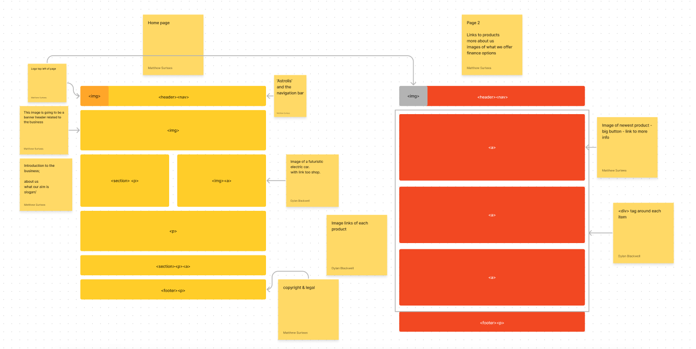

# Class 4 - Structure web pages with HTML

In this class, we have done a group project. The aim of this group task is to come up with a concept and design & create a webpage using HTML & CSS. 

#### Wireframe - Deisgning a web layout before HTML

In our group's we brainstormed our topic which we are basing our design around. Below is a photo of our base project we created using 'Figma'.

## Structuring your HTML

Within your HTML there are 2 main components;
  - Head:  What the browser uses to create your browser page (behind the scences)
  
  - Body:  This is what you see on your browser page
    - Within the body you have 3 main areas;
        - Header 
        - Main
        - Footer

Within the different sections you can add images, navigation menu's, paragraphs etc.

#### Reference Links;

[Wireframe & Design](https://careerfoundry.com/en/blog/ux-design/how-to-create-your-first-wireframe/)

[HTML Basics](https://developer.mozilla.org/en-US/docs/Learn/Getting_started_with_the_web/HTML_basics)

[Semantics](https://developer.mozilla.org/en-US/docs/Glossary/Semantics)
